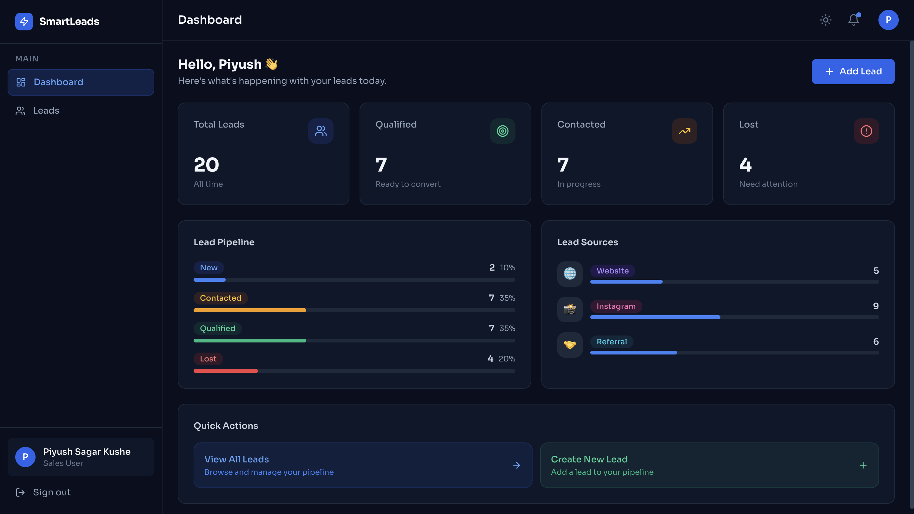
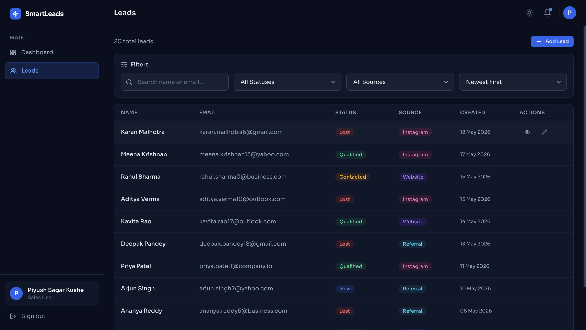

# Smart Leads Dashboard

> A production-ready full-stack Lead Management CRM built with the MERN stack, TypeScript, and TailwindCSS.

---

## ✨ Features

- 🔐 **JWT Authentication** — Secure login/register with HTTP-only cookies and localStorage token strategy
- 👥 **Role-Based Access Control (RBAC)** — Admin (full access + delete + CSV export) and Sales User roles
- 📋 **Lead Management (CRUD)** — Create, view, edit, and delete leads with full form validation
- 🔎 **Advanced Filtering** — Multi-filter by Status, Source, Name/Email search (debounced), and sort order
- 📄 **Backend Pagination** — skip/limit with metadata support
- 📤 **CSV Export** — Admin-only export of filtered leads
- 🌙 **Dark Mode** — Persisted theme toggle
- 📱 **Responsive Design** — Mobile-first layout optimized for all screen sizes
- 🔔 **Toast Notifications** — Real-time feedback for all actions
- ⚡ **Loading Skeletons & Empty States** — Smooth polished user experience

---

# 🖼️ Screenshots
## 📊 Dashboard Overview

<p align="center">
  
</p>

<div align="center">

Interactive dashboard with analytics cards, lead pipeline stats, and source breakdown charts.

</div>

---

## 📋 Leads Management

<p align="center">
  
</p>

<div align="center">

Advanced lead table with filtering, sorting, pagination, and CRUD operations.

</div>

---

# 🛠️ Tech Stack

## Frontend

| Technology | Purpose |
|---|---|
| React 18 + TypeScript | UI Framework |
| TailwindCSS | Utility-first Styling |
| React Router v6 | Client-side Routing |
| TanStack React Query v5 | Server State Management |
| React Hook Form + Zod | Form Validation |
| Axios | HTTP Client |
| react-hot-toast | Notifications |
| Lucide React | Icons |

---

## Backend

| Technology | Purpose |
|---|---|
| Node.js + Express | API Server |
| TypeScript | Type Safety |
| MongoDB + Mongoose | Database + ODM |
| JWT (jsonwebtoken) | Authentication |
| bcryptjs | Password Hashing |
| express-validator | Request Validation |
| Zod | Environment Validation |
| Helmet + CORS | Security |

---

# 🚀 Quick Start

## 📌 Prerequisites

- Node.js 18+
- MongoDB (Local or Atlas)
- npm or yarn

---

## 1️⃣ Clone & Install

```bash
git clone https://github.com/your-username/smart-leads-dashboard.git
cd smart-leads-dashboard

# Install backend dependencies
cd backend && npm install

# Install frontend dependencies
cd ../frontend && npm install
```

---

## 2️⃣ Environment Setup

```bash
# Backend
cd backend
cp .env.example .env

# Frontend
cd ../frontend
cp .env.example .env
```

### Backend `.env`

```env
NODE_ENV=development
PORT=5000
MONGODB_URI=mongodb://localhost:27017/smart-leads
JWT_SECRET=your_super_secret_jwt_key_at_least_32_characters_long
JWT_EXPIRES_IN=7d
FRONTEND_URL=http://localhost:5173
```

---

## 3️⃣ Seed Demo Data

```bash
cd backend
npm run seed
```

### Demo Credentials

| Role | Email | Password |
|---|---|---|
| Admin | admin@smartleads.com | Admin@123 |
| Sales | sales@smartleads.com | Sales@123 |

---

## 4️⃣ Run Development Servers

### Terminal 1 — Backend

```bash
cd backend
npm run dev
```

### Terminal 2 — Frontend

```bash
cd frontend
npm run dev
```

### App URLs

| Service | URL |
|---|---|
| Frontend | http://localhost:5173 |
| Backend API | http://localhost:5000 |

---

# 🐳 Docker Setup

## Using Docker Compose

```bash
docker-compose up --build
```

### Custom JWT Secret

```bash
JWT_SECRET=your_secret_here docker-compose up --build
```

---

# 📁 Project Structure

```bash
smart-leads-dashboard/
├── backend/
│   ├── src/
│   │   ├── config/
│   │   ├── controllers/
│   │   ├── database/
│   │   ├── middleware/
│   │   ├── models/
│   │   ├── routes/
│   │   ├── services/
│   │   ├── types/
│   │   ├── utils/
│   │   ├── validators/
│   │   ├── app.ts
│   │   └── server.ts
│   ├── Dockerfile
│   └── package.json
│
├── frontend/
│   ├── src/
│   │   ├── api/
│   │   ├── components/
│   │   ├── context/
│   │   ├── hooks/
│   │   ├── layouts/
│   │   ├── pages/
│   │   ├── routes/
│   │   ├── styles/
│   │   ├── types/
│   │   ├── constants/
│   │   ├── App.tsx
│   │   └── main.tsx
│   ├── Dockerfile
│   └── package.json
│
├── docker-compose.yml
└── README.md
```

---

# 📚 API Documentation

## Base URL

```bash
http://localhost:5000/api
```

---

## 🔐 Authentication Endpoints

### POST `/auth/register`

```json
{
  "name": "Rahul Sharma",
  "email": "rahul@example.com",
  "password": "Rahul@123",
  "role": "sales"
}
```

---

### POST `/auth/login`

```json
{
  "email": "admin@smartleads.com",
  "password": "Admin@123"
}
```

---

### POST `/auth/logout`

Logout current user.

---

### GET `/auth/profile`

Get logged-in user profile.

---

# 📋 Leads Endpoints

| Method | Endpoint | Description |
|---|---|---|
| GET | `/leads` | Get all leads |
| GET | `/leads/:id` | Get single lead |
| POST | `/leads` | Create lead |
| PUT | `/leads/:id` | Update lead |
| DELETE | `/leads/:id` | Delete lead |
| GET | `/leads/stats` | Dashboard statistics |
| GET | `/leads/export` | Export CSV (Admin only) |

---

# 🔎 Query Parameters

| Param | Example |
|---|---|
| status | Qualified |
| source | Instagram |
| search | Rahul |
| page | 1 |
| limit | 10 |
| sort | latest |

---

# 📤 CSV Export

Admins can export filtered leads directly into CSV format.

```bash
GET /leads/export
```

---

# ❌ Error Response Format

```json
{
  "success": false,
  "message": "Validation failed",
  "errors": [
    {
      "field": "email",
      "message": "Please enter a valid email"
    }
  ]
}
```

---

# 📌 HTTP Status Codes

| Code | Meaning |
|---|---|
| 200 | Success |
| 201 | Created |
| 400 | Validation Error |
| 401 | Unauthorized |
| 403 | Forbidden |
| 404 | Not Found |
| 409 | Conflict |
| 500 | Server Error |

---

# ☁️ Deployment

## Frontend → Vercel

```bash
cd frontend
npm run build
```

Set:

```env
VITE_API_URL=https://your-backend-url/api
```

---

## Backend → Render / Railway

### Environment Variables

```env
NODE_ENV=production
MONGODB_URI=mongodb+srv://...
JWT_SECRET=your_secret
FRONTEND_URL=https://your-frontend-url.vercel.app
```

### Build Command

```bash
npm install && npm run build
```

### Start Command

```bash
node dist/server.js
```

---

# 🧪 Suggested Git Commits

```bash
feat: initialize MERN project with TypeScript
feat: implement JWT authentication
feat: implement RBAC authorization
feat: implement leads CRUD operations
feat: implement advanced filtering and pagination
feat: implement CSV export feature
feat: implement dashboard analytics
feat: implement React Query hooks
feat: implement responsive UI with TailwindCSS
feat: add Docker support
feat: add dark mode support
fix: handle global API errors
chore: update README and screenshots
```

---

# 📸 Screenshot Folder Structure

```bash
screenshots/
├── login-page.png
├── dashboard-overview.png
├── leads-management.png
├── lead-form-modal.png
└── dark-mode.png
```

---

# 🌟 Future Improvements

- 📧 Email notifications
- 📈 Real-time analytics
- 🤖 AI lead scoring
- 📞 Call activity tracking
- 🔗 CRM integrations
- 📊 Advanced reporting

---

# 🤝 Contributing

Contributions, issues, and feature requests are welcome!

```bash
# Fork the repo
# Create feature branch
git checkout -b feature/amazing-feature

# Commit changes
git commit -m "feat: add amazing feature"

# Push branch
git push origin feature/amazing-feature
```

---

# 📄 License

MIT © Smart Leads Dashboard

---

# ⭐ Support

If you like this project, consider giving it a ⭐ on GitHub!

---
